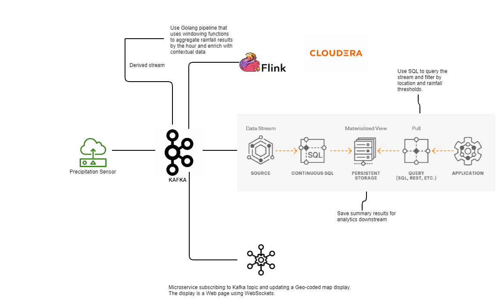
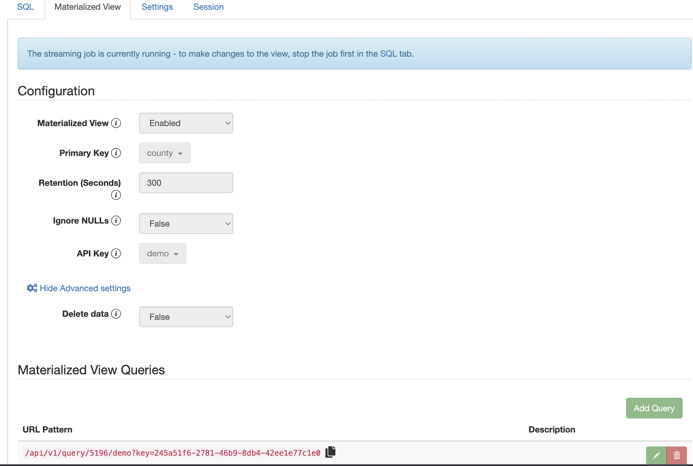

## High-Level Architecture for Demo

<br>

## Install Cloudera Streaming Analytics (CSA) via Docker Compose

From Linux or Mac laptop/desktop:
```
export CSA_DOCKER_HOST=204.236.149.139
export PEM_FILE=${HOME}/Documents/Demos/creds/kdavis_pse_daily.pem

ssh -i ${PEM_FILE} ec2-user@${CSA_DOCKER_HOST}
```
Inside the EC2 host, configure environment and install dependneces
```
sudo yum update -y
sudo amazon-linux-extras install docker
sudo yum install -y jq
sudo service docker start
sudo systemctl enable docker
sudo usermod -a -G docker ec2-user
mkdir -p demo/dev/
sudo reboot
```
From Mac or Linux host, copy PEM file to EC2
```
scp -i ${PEM_FILE} ec2-user@${CSA_DOCKER_HOST}:/home/ec2-user/demo/dev/

ssh -i ${PEM_FILE} ec2-user@${CSA_DOCKER_HOST}
```
Inside the EC2 host, launch Docker instances
```
docker info
pip3 install docker-compose
cd demo/dev/
git clone https://github.com/kentontroy/cloudera-csa-demo
cd docker
export CML_DEMO_HOME=${PWD}
./jupyter.sh

docker-compose up -d --scale flink-taskmanager=2

docker images
REPOSITORY                                                 TAG          IMAGE ID       CREATED        SIZE
docker.repository.cloudera.com/csa/ssb-docker_console      1.6.0.0-ce   d1c19979f5a6   2 months ago   1.15GB
docker.repository.cloudera.com/csa/ssb-docker_snapper      1.6.0.0-ce   7fd4fb668e59   2 months ago   500MB
docker.repository.cloudera.com/csa/ssb-docker_sqlio        1.6.0.0-ce   4240d40117e0   2 months ago   1.08GB
docker.repository.cloudera.com/csa/ssb-docker_flink        1.6.0.0-ce   fe14195232c3   2 months ago   2.22GB
docker.repository.cloudera.com/csa/ssb-docker_zookeeper    1.6.0.0-ce   db44b3d523f9   2 months ago   441MB
docker.repository.cloudera.com/csa/ssb-docker_kafka        1.6.0.0-ce   231ddba4d185   2 months ago   480MB
docker.repository.cloudera.com/csa/ssb-docker_postgresql   1.6.0.0-ce   ecd73b2f255c   2 months ago   542MB
```
## Access the Streaming Console:
```
http:<CSA_DOCKER_HOST>:8000/

Default Credentials: admin/admin
```

## Run Kafka commands for topic maintenance

Create a topic:
```
docker-compose exec kafka /opt/kafka/bin/kafka-topics.sh --bootstrap-server kafka:9092 --create \
  --topic demo_hurricane_metrics --partitions 8
```
NOTE: if you're Kafka consumer is running on a node external to the Docker host, you have to resolve the DNS
      name used by Docker -> kafka
```
cat /etc/hosts
...
# For customer-facing tests
204.236.149.139 kafka
...
```
Consume a topic:
```
docker-compose exec kafka /opt/kafka/bin/kafka-console-consumer.sh --bootstrap-server kafka:9092 \
  --from-beginning --topic demo_hurricane_metrics
```
Delete a topic:
```
docker-compose exec kafka /opt/kafka/bin/kafka-topics.sh --bootstrap-server kafka:9092 --delete \
  --topic demo_hurricane_metrics 
```

## Use SQL Stream Builder (SSB) 

Login to the browser-based Console at port 8000.
Wizards in SSB can automate the creation of the DDL in Flink:
```
CREATE TABLE `ssb`.`ssb_default`.`demo_hurricane_metrics` (
  `us_state` VARCHAR(2147483647),
  `us_county` VARCHAR(2147483647),
  `hazard_metric` DOUBLE,
  `eventTimestamp` TIMESTAMP(3) METADATA FROM 'timestamp',
  WATERMARK FOR `eventTimestamp` AS `eventTimestamp` - INTERVAL '60' SECOND
) COMMENT 'demo_hurricane_metrics'
WITH (
  'properties.bootstrap.servers' = 'kafka:9092',
  'properties.auto.offset.reset' = 'earliest',
  'connector' = 'kafka',
  'properties.request.timeout.ms' = '120000',
  'properties.transaction.timeout.ms' = '900000',
  'format' = 'json',
  'topic' = 'demo_hurricane_metrics',
  'scan.startup.mode' = 'earliest-offset'
)
```
Start a Kafka Consumer (i.e. the weather/hurricane simulator):
```
bokeh serve --show controller.py
```
Run a continuous query against the incoming, unbounded stream:
```
SELECT * FROM demo_hurricane_metrics
;
```
## Build a Materialized View
Create a continuous query to aggregate (by AVG) data into 10-minute intervals
```
SELECT AVG(CAST(hazard_metric AS numeric)) AS avg_hazard_metric,
       CAST(TUMBLE_END(eventTimestamp, interval '10' minute) AS varchar) AS ts,
       us_county || ', ' || us_state AS county 
FROM demo_hurricane_metrics
GROUP BY us_state, us_county, TUMBLE(eventTimestamp, interval '10' minute) 
; 
```
Build a Materialized View from the query.
SSB will create a REST endpoint (static or dynamic) with an embedded API key

```
curl http://localhost:18131/api/v1/query/5196/demo?key=245a51f6-2781-46b9-8db4-42ee1e77c1e0 | jq

[
  {
    "avg_hazard_metric": "21.192308",
    "ts": "2022-03-08 00:30:00.000",
    "county": "Grady, OK"
  },
  {
    "avg_hazard_metric": "20.880000",
    "ts": "2022-03-08 00:30:00.000",
    "county": "Bell, TX"
  },
  ......
]
```

<br>

## Install Go for use with Apache Beam and the Flink Runner
```
export GOPATH=$HOME/go/pkg/mod/
export GOROOT=/usr/local/go
export GOBIN=${GOROOT}/bin
export PATH=$PATH:${GOBIN}

go get github.com/apache/beam/sdks/v2/go/pkg/beam@latest
ls -al ${GOPATH}/github.com/apache/beam/sdks/v2@v2.36.0/go/pkg/beam

mkdir wordcount
cd wordcount
go mod init pse.cloudera.com/wordcount
go build wordCount.go

mkdir demo
cd demo
go mod init pse.cloudera.com/demo

go mod edit -replace pse.cloudera.com/wordcount=../wordcount
go mod tidy
go build demoWordCount.go
go run demoWordCount.go \
  --inputFile "shakespeare.txt" \
  --outputFile "wordCount.out"

go build demoWordCountAdvanced.go
go run demoWordCountAdvanced.go \
  --outputFile "wordCount.out"
 
```
